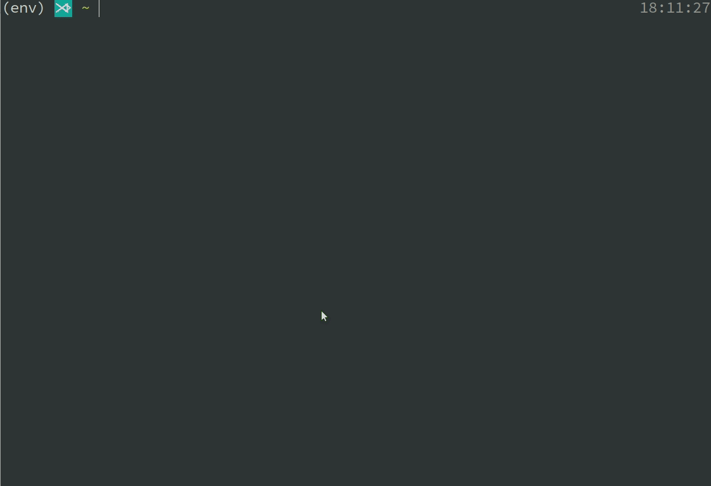

# cita-cli

[](https://travis-ci.org/cryptape/cita-cli)

An easy-to-use [CITA](https://github.com/cryptape/cita) command line tool.

Just like the relationship between redis-cli and redis.

## Overview

[cita-cli](./cita-cli): a binary project, command line tool.

[cita-tool](./cita-tool): a crate to support cita-cli, of course, can also be used for secondary development, which contains all the methods needed.

> This project assumes that the user understands what the smart contract is.

## Usage

### Screencast



### Clone and Build

You can download the compiled version [here](https://github.com/cryptape/cita-cli/releases),
if you want the latest version, compile the source code like follow, default support Secp256k1/Sm2 algorithms:

```bash
$ git clone https://github.com/cryptape/cita-cli.git
$ rustup update stable
$ cd cita-cli/cita-cli
$ cargo install --path .
```
it will install on `~/.cargo/bin/cita-cli`

If you want to support https requests, make sure that `openssl` exists in the build environment and
compile with the following command:

```bash
$ cd cita-cli/cita-cli
$ cargo install --features tls --path .
```

> `openssl` is statically compiled in [release](https://github.com/cryptape/cita-cli/releases),
> and https requests is supported by default.

If you want to support Secp256k1/Sm2/Ed25519 three algorithms at the same time, as follows and make sure clang version > 3.9

```bash
$ sudo apt install clang
$ wget https://github.com/jedisct1/libsodium/releases/download/1.0.16/libsodium-1.0.16.tar.gz
$ tar xvfz libsodium-1.0.16.tar.gz
$ cd libsodium-1.0.16
$ ./configure --prefix=$HOME/libsodium
$ make && make install
$ export PKG_CONFIG_PATH=$HOME/libsodium/lib/pkgconfig:$PKG_CONFIG_PATH
$ export LD_LIBRARY_PATH=$HOME/libsodium/lib:$LD_LIBRARY_PATH

$ git clone https://github.com/cryptape/cita-cli.git
$ cd cita-cli/cita-cli
$ cargo install --features ed25519 --path .
$ cd ..
```

#### Compile the Linux cross-platform version

- First, install `musl-gcc`, default on `/usr/local/musl`

```bash
$ wget https://www.musl-libc.org/releases/musl-1.1.19.tar.gz
$ tar -xzvf musl-1.1.19.tar.gz
$ cd musl-1.1.19/
$ ./configure && make && sudo make install
$ sudo ln -sf /usr/local/musl/bin/musl-gcc /usr/local/bin/musl-gcc
```

- Second, add `x86_64-unknown-linux-musl` toolchain

```bash
$ rustup target add x86_64-unknown-linux-musl
```

- Third, build

```bash
$ cargo install --target x86_64-unknown-linux-musl --path .
```

> Note: only for secp256k1/sm2 version, since libsodium is dynamically linked,
> first need to be changed to static link,
> then need to use musl-gcc to recompile libsodium the entire library

### Examples

If you think that the url specified on the command line is too complex, you can write the env file directly, 
or the corresponding environment variable cli will get it automatically.

#### Interactive mode(recommend)

```bash
$ cita-cli
[       url        ]: http://121.196.200.225:1337
[       pwd        ]: /home/luoc/Rust-work/cita-cli
[      color       ]: true
[      debug       ]: true
[       json       ]: true
[    encryption    ]: secp256k1
[ completion_style ]: List
[    edit_style    ]: Emacs
[   save_private   ]: false
cita> switch --url http://121.196.200.225:1337
cita> rpc blockNumber
{
  "jsonrpc": "2.0",
  "result": "0x5fbb2",
  "id": 1
}
cita> key create 
{
  "address": "0x1cd05e93e7501c125f14a4859c854fa6d0e63ad6",
  "private": "0xfed11b78f963f7cf3de6fc43087900b13e449055e8a9bae1e9dc369412cdddca",
  "public": "0xc10a38330fe144062d4a67e2de6f7eed5acf30da9dfd0fb0ecb86d05643afcc4a1b3b34b07731da088c2f564807049ba6632cb94dbcae81d1984ba248d5e5d1e"
}
cita> info
[       url        ]: http://121.196.200.225:1337
[       pwd        ]: /home/luoc/Rust-work/cita-cli
[      color       ]: true
[      debug       ]: true
[       json       ]: true
[    encryption    ]: secp256k1
[ completion_style ]: List
[    edit_style    ]: Emacs
[   save_private   ]: false
cita> ethabi encode params --param uint256 16
0000000000000000000000000000000000000000000000000000000000000010
cita> ethabi encode function --file ../HelloWorld.abi --name update --param 16
82ab890a0000000000000000000000000000000000000000000000000000000000000010
cita> ethabi encode params --param address 08d1a8bbec3dbc2e4fa930dfb6886732f3a72aeb --param uint256 16
"00000000000000000000000008d1a8bbec3dbc2e4fa930dfb6886732f3a72aeb0000000000000000000000000000000000000000000000000000000000000010"
cita> exit
```

#### Command line mode

> Tips: Add `source <(cita-cli completions bash)` to your `.bashrc` to provide command completion.

- Get chain height
```bash
$ cita-cli rpc blockNumber --url http://121.196.200.225:1337
{
  "jsonrpc": "2.0",
  "result": "0x1bc7f",
  "id": 1
}
```

- Send transaction
```bash
$ cita-cli rpc sendRawTransaction \
    --private-key "0x352416e1c910e413768c51390dfd791b414212b7b4fe6b1a18f58007fa894214" \
    --code "0x606060405234156100105760006000fd5b610015565b60e0806100236000396000f30060606040526000357c0100000000000000000000000000000000000000000000000000000000900463ffffffff16806360fe47b114604b5780636d4ce63c14606c576045565b60006000fd5b341560565760006000fd5b606a60048080359060200190919050506093565b005b341560775760006000fd5b607d60a3565b6040518082815260200191505060405180910390f35b8060006000508190909055505b50565b6000600060005054905060b1565b905600a165627a7a72305820942223976c6dd48a3aa1d4749f45ad270915cfacd9c0bf3583c018d4c86f9da20029" \
    --height 111146 \
    --url http://121.196.200.225:1337
{
  "jsonrpc": "2.0",
  "result": {
    "status": "OK",
    "hash": "0x16251c374ee87eae41cbd9203eea481b861738a19c19df9d3c6603b9fbe84478"
  },
  "id": 2
}
```

- Get transaction receipt
```bash
$ cita-cli rpc getTransactionReceipt \
    --hash "0x16251c374ee87eae41cbd9203eea481b861738a19c19df9d3c6603b9fbe84478" \
    --url http://121.196.200.225:1337
{
  "jsonrpc": "2.0",
  "result": {
    "transactionHash": "0x16251c374ee87eae41cbd9203eea481b861738a19c19df9d3c6603b9fbe84478",
    "logs": [],
    "blockNumber": "0x1b234",
    "transactionIndex": "0x0",
    "cumulativeGasUsed": "0xafc8",
    "gasUsed": "0xafc8",
    "blockHash": "0xca3733ac87fab23dc3c6c9b644631c98a937b369183c44f5743c5179587a3028",
    "root": null,
    "errorMessage": null,
    "logsBloom": "0x00000000000000000000000000000000000000000000000000000000000000000000000000000000000000000000000000000000000000000000000000000000000000000000000000000000000000000000000000000000000000000000000000000000000000000000000000000000000000000000000000000000000000000000000000000000000000000000000000000000000000000000000000000000000000000000000000000000000000000000000000000000000000000000000000000000000000000000000000000000000000000000000000000000000000000000000000000000000000000000000000000000000000000000000000000000",
    "contractAddress": "0xd9ae0a3b3e856bf5d01061d99721cc4b136d7e26"
  },
  "id": 1
}
```

- Call contract function
```bash
$ cita-cli rpc sendRawTransaction \
    --private-key "0x352416e1c910e413768c51390dfd791b414212b7b4fe6b1a18f58007fa894214" \
    --address "0x73552bc4e960a1d53013b40074569ea05b950b4d" \
    --code "0x60fe47b10000000000000000000000000000000000000000000000000000000000000001" \
    --url http://121.196.200.225:1337
{
  "jsonrpc": "2.0",
  "result": {
    "status": "OK",
    "hash": "0x16001b0498c9b80133278a851859b859ada264d2928fd9b2bf0a1ba716079d23"
  },
  "id": 2
}
```

- Get call result
```bash
$ cita-cli rpc call \
    --to 0xd9ae0a3b3e856bf5d01061d99721cc4b136d7e26 \
    --data 0x6d4ce63c \
    --height latest \
    --url http://121.196.200.225:1337 
{
  "jsonrpc": "2.0",
  "result": "0x0000000000000000000000000000000000000000000000000000000000000001",
  "id": 1
}
```

- Create new key pair
```bash
$ cita-cli key create
{
  "address": "0x53ca05180d61bdc1c57b9c819c7545a87b1f3a1d",
  "private": "0x49b7b71ce0120d727db74dde8cf7bec89626b5ff2f5c7522f4b8d4ffc878f2b7",
  "public": "0xab7d29be188005a54d479a9971fba9faa7f28d637c83166f95de52f7f664b88ac9a3e7b570b462ec66702aac381da84021a52883f18ab1944df08f58db677982"
}
```

- Generate public keys and addresses based on private keys
```bash
$ cita-cli key from-private --private-key 0x993ef0853d7bf1f4c2977457b50ea6b5f8bc2fd829e3ca3e19f6081ddabb07e9
{
  "address": "0x9dcd6b234e2772c5451fd4ccf7582f4283140697",
  "private": "0x993ef0853d7bf1f4c2977457b50ea6b5f8bc2fd829e3ca3e19f6081ddabb07e9",
  "public": "0xa3cadf91b0ad021eb05eaa1fc2bb66109b3d004808c5cc2a1fb251a881aa12615394bde17dfaea4fb84372344d28a1bd2c4a9b4ab3f5d34ae524e2431ce494b6"
}
```

- ABI generate
```bash
$ cita-cli ethabi encode params --param uint256 16
0000000000000000000000000000000000000000000000000000000000000010
$ cita-cli ethabi encode function --file ../HelloWorld.abi --name update --param 16
82ab890a0000000000000000000000000000000000000000000000000000000000000010
```

## Contribute

Please submit to [https://github.com/cryptape/cita-cli](https://github.com/cryptape/cita-cli) this repo
